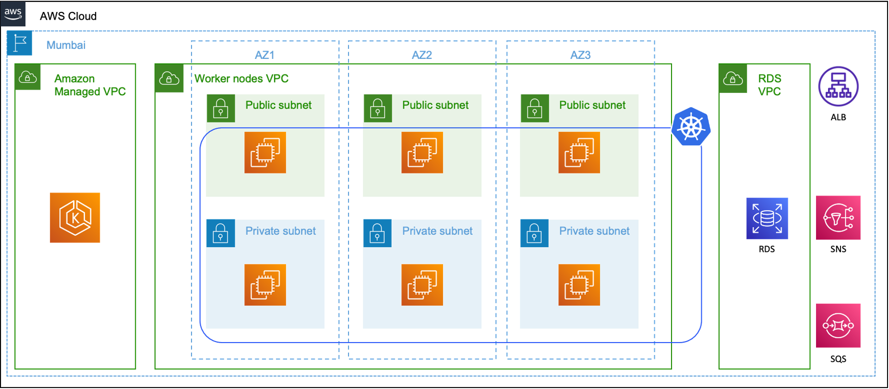

# Architecture

This page describes the architecture of the microservices to be deployed as part of the Mock Test.

## Diagram - Cloud

This diagram describes the managed services that comprise the overall solution without getting into Kubernetes components.

1. The solution will reside in `ap-south-1` (Mumbai) region.
2. The `Amazon Managed VPC` will be automtically created when Amazon EKS cluster is launched. This VPC will host the Kubernetes control plane.
3. The `Worker nodes` VPC will host the worker nodes of the Amazon EKS cluster.
4. The `RDS VPC` will host an Amazon RDS database running MySQL database. This will be the default VPC of the account.
5. An Application Load Balancer (ALB) will route requests from Internet to pods running in the k8s cluster.
6. Topics on Amazon SNS and queues in Amazon SQS will be used to route traffic between the microservices.

## Diagram - Kubernetes

> You are expected to add a Kubernetes specific architecture diagram covering pods, services, ingress, etc.

## Flow

This section describes the flow of data.

1. An internet user invokes the `Orders` API using the ALB DNS.
2. The request is routed to the `svc/orders` via the `ing/orders`.
3. This request lands at the pod that is front-ended by `svc/orders`.
4. The pod of `Orders` microservice responds back with a HTTP status code `201` acknowledging the request.
5. The pod of `Orders` microservice publishes a message to a Amazon SNS topic which is subscribed to by Amazon SQS queue.
6. The `svc/orchestrator` is subscribed to this queue and routes the message to `Inventory` microservice via `svc/inventory`.
7. The pod of `Inventory` microservice updates the Amazon RDS database.
